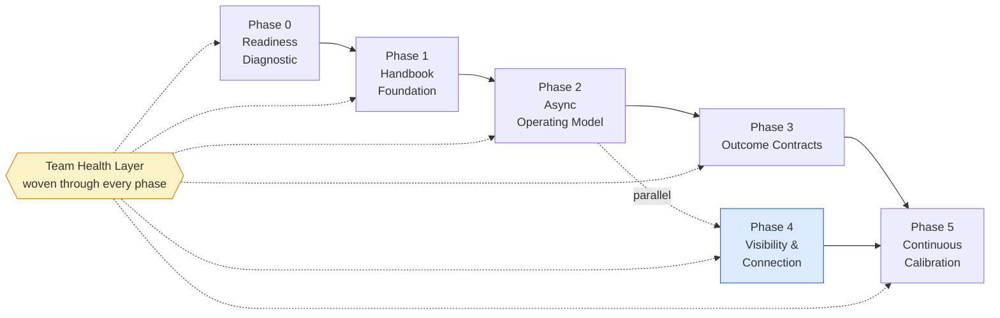

# REMOTE

**An opinionated, phase-based operating model for software companies running fully remote. Like Agile, but for how a remote company actually runs.**

---

## The Problem

Most "remote work policies" are office defaults in a trench coat. Same meetings, same hierarchy, same presenteeism — now mediated by Zoom and Slack. Predictably, they fail. Leadership concludes "remote doesn't work," issues an RTO mandate, and loses their best people in the bargain.

The problem is not remote work. The problem is bad defaults. Companies that have made all-remote work for 10+ years — GitLab, Automattic, Doist, Zapier — didn't outwork their problems. They redesigned the defaults.

**That redesign is what this is.**

---

## What This Is

A process framework — like SDLC or Agile — for *how a remote company runs itself*. Not values on a wall. Six phases, concrete rituals, reusable templates, and an explicit map of every anti-pattern worth naming.

Think of it as the operating system beneath your product development process: the part that determines how decisions get made, how work gets visible, how teams stay healthy, and how new people ramp up without an office to absorb them.

---

## Framework at a Glance

| Phase | Name | Duration | Behavioral Shift |
|-------|------|----------|------------------|
| 0 | Readiness Diagnostic | 2–4 weeks | Honest baseline. No theater. |
| 1 | The Handbook Foundation | 4–8 weeks | Write it down before you say it. |
| 2 | The Async Operating Model | 6–12 weeks | A meeting is a failure mode. |
| 3 | Outcome Contracts | 8–12 weeks | Trust by default, calibrate by output. |
| 4 | Visibility & Connection | Parallel from Phase 2, ongoing | Make work seeable, make people seen. |
| 5 | Continuous Calibration | Ongoing | The system is the product. |

Phase 0 is mandatory and first. Phase 1 must precede Phase 2. Phase 4 starts in parallel with Phase 2, not after. Phase 5 runs continuously once Phase 3 lands.

---

## The Five Principles

Everything in the playbook reduces to five principles:

1. **Trust is the default, not the reward.** Grant it by default; revoke it only on specific evidence.
2. **Writing is the unit of work.** If it isn't written, it didn't happen. If it isn't searchable, it didn't scale.
3. **Async is the default; sync is the exception.** Reserve sync for high-bandwidth, high-ambiguity work.
4. **Outcomes are the contract.** Stop trying to see activity. Start measuring outcomes — at the role level, not just the task level.
5. **Visibility is engineered, both ways.** Make it easy to show work, and make it normal to notice it.

---

## Who This Is For

- **Engineering leaders** (CTO, VP Eng, Head of Eng) at tech companies of 20–2,000 people deciding how to run their org
- **Founders** going all-remote from day one and looking for a model, not improvisation
- **People-ops leaders** working with engineering to make remote actually work — not just policy-compliant
- **Anyone handed "figure out remote"** with no playbook and a deadline
- **Teams post-RTO** reconsidering whether the failure was remote work or a failure of design

This is not a hybrid playbook. It is not an HR compliance document. It is not a defense of remote work — the data has already done that.

---

## Why This Exists

The data is unambiguous: 50% of knowledge workers report their employer suffers from "productivity paranoia." 25% of executives openly admit RTO mandates are used as a passive layoff tool. MIT Sloan's review of the evidence concluded that "every piece of evidence so far has shown negative results" for RTO mandates improving performance.

And yet remote work genuinely does fail — not because people are at home, but because companies transplant office defaults into a remote context and wonder why they don't fit. The fix is not surveillance software or mandatory cameras or more standup meetings. The fix is redesigning the defaults.

This playbook is that redesign, synthesized from what the companies that got it right actually do.

---

## Quick Start

Read [REMOTE.md](./REMOTE.md). Start with Phase 0.

If you only have 10 minutes, read:
- [The Five Principles](./REMOTE.md#the-five-principles)
- [The Team Health Layer](./REMOTE.md#the-team-health-layer)
- [Phase 0 — Readiness Diagnostic](./REMOTE.md#phase-0--readiness-diagnostic)

If you're a manager, start with [For the Engineering Manager](./REMOTE.md#for-the-engineering-manager).

If you're an IC, start with [For the Individual Contributor](./REMOTE.md#for-the-individual-contributor).

---

## Contributing

Contributions are welcome — bugs in the model, missing rituals, better templates, real-world corrections from orgs running this.

See [CONTRIBUTING.md](./CONTRIBUTING.md) for the process. Short version: fork, branch, PR with reasoning, two reviewers, async discussion.

---

## License

MIT — see [LICENSE](./LICENSE). Use this freely. Adapt it for your company. If you build something useful on top of it, consider contributing back.
