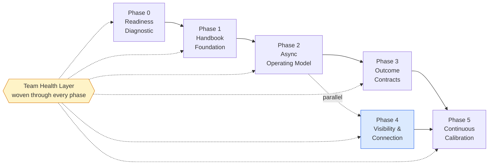

# REMOTE
### An All-Remote Operating Model for Software Companies

> A process framework for tech companies that want to operate fully remote — without rebuilding office defaults on top of Zoom.
>
> Think of this as the SDLC or Agile equivalent for *how a remote company runs itself*. Not values on a wall. Phases, rituals, templates, and explicit behavioral shifts.

**Status:** v2.1 · **License:** MIT · **Contributions welcome** via PR.

---

## Table of Contents

- [Why This Document Exists](#why-this-document-exists)
- [The Five Principles](#the-five-principles)
- [The Team Health Layer](#the-team-health-layer)
- [How to Use This Document](#how-to-use-this-document)
- [The Framework at a Glance](#the-framework-at-a-glance)
- [The Phases](#the-phases)
  - [Phase 0 — Readiness Diagnostic](#phase-0--readiness-diagnostic)
  - [Phase 1 — The Handbook Foundation](#phase-1--the-handbook-foundation)
  - [Phase 2 — The Async Operating Model](#phase-2--the-async-operating-model)
  - [Phase 3 — Outcome Contracts](#phase-3--outcome-contracts)
  - [Phase 4 — Visibility & Connection](#phase-4--visibility--connection)
  - [Phase 5 — Continuous Calibration](#phase-5--continuous-calibration)
- [Role Guides](#role-guides)
  - [For the Individual Contributor](#for-the-individual-contributor)
  - [For the Engineering Manager](#for-the-engineering-manager)
  - [For Engineering Leadership](#for-engineering-leadership)
- [Anti-Patterns](#anti-patterns)
- [Templates](#templates)
- [Recommended Tooling Stack](#recommended-tooling-stack)
- [Metrics to Track](#metrics-to-track)
- [Contributing](#contributing)

---

## Why This Document Exists

Most "remote work policies" are office defaults in a trench coat. Same meetings, same hierarchy, same presenteeism — now mediated by Zoom and Slack. Predictably, they fail. Leadership concludes "remote doesn't work," issues an RTO mandate, and loses their best people in the bargain.

The data is unambiguous:

- 50% of knowledge workers report their employer suffers from **"productivity paranoia"**.
- 25% of executives openly admit RTO mandates are used as a **passive layoff tool**, not a productivity tool.
- MIT Sloan's review of the evidence: *"every piece of evidence so far has shown negative results"* for RTO mandates improving performance.
- Stanford: fully remote employees are ~13% more productive on individual task completion.
- 79% of managers say their teams are *more* productive remote — and many of those same managers signed RTO mandates.
- BUT: Microsoft's 2025 Work Trend Index found cross-team collaboration drops 17% in fully remote settings, and new hires take **28% longer to ramp up** without engineered onboarding.

Remote work crushes the office for focus and individual output. It loses to the office on collaboration, onboarding, and — most importantly — on team health, *unless you design around it*. The companies that have made all-remote work for 10+ years (GitLab, Automattic, Doist, Zapier) didn't outwork their problems. They redesigned the defaults.

**That redesign is the entire point of this document.**

### The Core Problem Is Trust — and It's a Systems Problem

When a manager doesn't trust a remote employee, surveillance software won't fix it; it will make it worse. When a company can't tell who is contributing, it's not because people are at home — it's because the company has no system to make contribution visible.

This document doesn't try to police people. It redesigns the defaults so the right behaviors become the easy ones, and the wrong behaviors stand out. Bad processes hide bad work. Good processes surface it without surveillance.

### Who This Is For

- Engineering leaders (CTO, VP Eng, Head of Eng) at tech companies of 20–2000 people
- Founders deciding whether to go all-remote from day one
- People-ops leaders working with engineering to make remote actually work
- Anyone tasked with "let's just figure out remote" with no playbook to follow

### What This Is *Not*

- A hybrid playbook (hybrid has its own real challenges; this opinionated version is all-remote)
- A policy document for HR compliance
- A defense of remote work — the data has done that already
- A toolkit pitch — tools are listed, but the process is the product

---

## The Five Principles

Everything in this playbook reduces to five principles. Read them. Disagree with them now if you must. By the end of Phase 2, they should feel obvious.

### 1. Trust is the default, not the reward.

In an office, trust is granted because people are visible. Remove visibility and you discover whether trust ever existed, or whether it was just observation in disguise. An all-remote company has to grant trust *by default* and revoke it only on specific evidence — the opposite of how most managers were trained.

### 2. Writing is the unit of work.

In an office, the unit of work is a conversation. Decisions happen in hallways, in standups, at lunch. In an all-remote company, the unit of work is a *written artifact* — a doc, an issue, an ADR, a PR description, a runbook. If it isn't written, it didn't happen. If it isn't searchable, it didn't scale.

### 3. Async is the default; sync is the exception.

Every meeting is a tax: on everyone's calendar, on every time zone, on every flow state. Sync should be reserved for *high-bandwidth, high-ambiguity* work: kickoffs, sensitive 1:1s, debugging-by-pairing, crisis response. Status, updates, planning, decisions — these are async by default.

### 4. Outcomes are the contract.

You cannot manage what you cannot see. In an all-remote company, you stop trying to see *activity* and start measuring *outcomes*. Every role has a clear definition of done at the role level — not just the task level. This requires more management work upfront, not less.

### 5. Visibility is engineered, both ways.

In an office, you see your colleagues working *and* they see you. Both directions matter. Remote can collapse to a model where people produce work that no one notices, while managers worry about whether people are working. The fix is the same in both directions: engineer visibility deliberately. Make it easy to *show* work, and make it normal to *notice* it.

---

## The Team Health Layer

Throughout this playbook, you'll see a **Team Health Watch** callout in every phase. This is the cross-cutting concern that every other phase has to serve, or the whole framework hollows out.

The office gave team health for free — through proximity, eye contact, lunch, hallway conversations, and the simple act of being seen working. All-remote takes those signals away. Most failed all-remote programs aren't failing on documentation or async — they're failing on team health. People are productive, then quietly disengaged, then gone.

A note on framing: this document uses **team health** and **psychological safety** as the operating language. The underlying needs are emotional, but engineering organizations adopt frameworks more readily when the language is functional. Treat the softness in the framing as a feature, not a euphemism — the rituals themselves are concrete.

### The Two Visibility Loops

Two needs do the most work in keeping teams healthy in remote settings. They're related but distinct, and most failing remote programs neglect both.

**1. Being seen** *(passive validation — what others give you)*
The daily, micro-scale signals that confirm "I exist, my work matters, someone noticed." In an office, you get hundreds of these per day without realizing — a nod, a "morning!", being included in lunch, eye contact in a meeting. In remote, you can go a full day without a single human signal that lands emotionally. Slack reactions help, but only if managers and peers are trained to use them as real validation, not as performative emoji-spam.

**2. Being able to show** *(active visibility — what you can do)*
The agency to surface your own work. In an office, you walk over to a desk and say "look at this." You demo in person. Your manager catches you mid-build. In remote, you merge a PR and it disappears into git history; you ship a feature and it appears in a release note nobody reads. Without deliberate *show-work* containers — demo days, highlight reels, recorded walkthroughs — your best work goes invisible, no matter how good it is.

Both loops fail differently. The first failure mode is *loneliness and quiet disengagement*. The second failure mode is *invisibility followed by attrition* — the high performer who builds excellent things, feels unseen, and quietly leaves.

The Team Health Watch callouts in each phase address what that phase contributes to these two loops, and what specific risks to watch for.

### A Design Principle for All Visibility Rituals

Every show-work and notice-work ritual carries the same risk: it can devolve into a popularity contest where the loud, extroverted, easy-to-promote people dominate, and the introverts, the quiet engineers, and the people in inconvenient time zones get *more* invisible than before.

Every ritual in Phase 4 is designed against this — fixed rotations, written-demo options, async-first formats, and explicit norms that center *the work*, not the performer. Adopters should hold this line. Visibility is for everyone, or it's not really visibility.

---

## How to Use This Document

This is a **process framework**, not a recipe. Use it like you'd use Scrum: adopt the structure, adapt the rituals, keep the principles.

**Sequencing:** The phases are partially ordered. Phase 0 is mandatory and first. Phase 1 must precede Phase 2. Phase 4 (Visibility & Connection) should be started in *parallel* with Phase 2, not after. Phase 5 (Calibration) runs continuously once Phase 3 lands.

**Timeline:** A 100-person company can realistically reach Phase 3 maturity in 6–9 months. Don't try to do it in 6 weeks. The cultural rewiring takes longer than the policy writing.

**Skipping:** You can skip nothing. You can shorten each phase based on your starting point, which Phase 0 will reveal.

**Adapting:** Smaller companies (<30 people) can compress Phases 1 and 3 heavily — there's less tribal knowledge to capture, fewer managers to retrain. Larger companies (>500) should add a transition team and treat each phase as a project with an owner.

---

## The Framework at a Glance

| Phase | Name | Duration | Behavioral Shift |
|-------|------|----------|------------------|
| 0 | Readiness Diagnostic | 2–4 weeks | Honest baseline. No theater. |
| 1 | The Handbook Foundation | 4–8 weeks | Write it down before you say it. |
| 2 | The Async Operating Model | 6–12 weeks | A meeting is a failure mode. |
| 3 | Outcome Contracts | 8–12 weeks | Trust by default, calibrate by output. |
| 4 | Visibility & Connection | Parallel from Phase 2, ongoing | Make work seeable, make people seen. |
| 5 | Continuous Calibration | Ongoing | The system is the product. |

---

## Phase 0 — Readiness Diagnostic

> **Goal:** Establish an honest baseline. Identify gaps. Surface leadership ambivalence *before* it sinks the program later.

**Duration:** 2–4 weeks
**Owner:** Head of Eng + People Ops
**Prerequisite:** Leadership commitment to all-remote (not "we'll try it"). If leadership is ambivalent, do not start. Fix that first.

### Behavioral Shift

From *"we already do remote"* to *"let's measure what we actually do."* This phase exists to kill the illusion that you're already remote-ready because some people work from home some days. Almost no company is.

### Activities

**1. Trust & Team Health Audit (anonymous).** A short survey, run independently of management. Sample questions:

*Trust dimension:*
- "I feel trusted to do my work without being monitored."
- "I know what success looks like in my role this quarter."
- "If I were stuck, I could find the answer in our documentation."
- "Decisions in my team are documented somewhere I can find."

*Team health dimension:*
- "I feel my work is noticed by the people who matter to me at work."
- "I have a clear channel to show what I've been building."
- "I know what my teammates worked on last week without asking them."
- "I feel safe disagreeing in writing on a team channel."
- "I have at least one person at work I'd call a friend."

Score each 1–5. Anything under 3.5 is a red flag. Trust scores and team health scores should be tracked separately — they fail differently and need different interventions.

**2. Work-Type Audit.** For each team, classify time spent across four buckets:
- *Focus work* (individual deep work) — remote excels here
- *Collaborative work* (pairing, design, debugging together) — needs deliberate design
- *Coordination work* (status, planning, alignment) — should mostly move async
- *Onboarding/ramp* (new hires, role changes) — highest risk in remote

Ratios will vary by role. Use them to inform Phase 2 and Phase 4 design.

**3. Tribal Knowledge Inventory.** Ask each team lead: "What does your team know that isn't written down?" Examples: how the deploy pipeline really works, why the data model is shaped the way it is, who to ask about the payments integration, why feature X was killed in 2022. List it all. This is your Phase 1 backlog.

**4. Tooling Audit.** Map current usage: docs, async comm, sync comm, project tracking, code collab. Identify duplication, gaps, and tools nobody uses. Don't change tools yet — observe.

**5. Manager Readiness Assessment.** A 1:1 with every people-manager. Two questions:
- *"If you couldn't see your team for a week, how would you know whether they did good work?"*
- *"How often do you write something specific that recognizes a report's work?"*

Note who has clear answers and who doesn't. The "doesn't" group is your Phase 3 retraining target.

> **🌱 Team Health Watch — Phase 0**
>
> This phase's contribution to team health is honesty. Measuring team health alongside trust separates two failure modes that look the same on the surface. A team with low trust scores needs Phase 3. A team with low team-health scores needs Phase 4. Conflating them will lead you to fix the wrong thing.
>
> Specifically watch for: a high-performing team with low team-health scores. They look fine on outcomes — they're already on the way out. The resignation will arrive in 90 days.

### Outputs

A 5–10 page diagnostic report containing:
- Trust score and team health score (overall and per team)
- Top 20 tribal-knowledge gaps
- Manager readiness map
- Tooling consolidation recommendations
- A clear-eyed list of risks ("Team X is led by a manager who measures hours")

### Exit Criteria

- Leadership has read the diagnostic and agreed to its findings
- A named owner exists for each subsequent phase
- A communication plan is in place for the company

### Common Pitfalls

- **Skipping the trust audit because "we know we're fine."** You don't. Run it.
- **Treating team health as nice-to-have.** It's the leading indicator for attrition. Measure it.
- **Letting managers write their own readiness assessment.** They will overrate themselves.
- **Treating Phase 0 as 1 day of planning.** Two weeks minimum. Surfacing reality takes time.

---

## Phase 1 — The Handbook Foundation

> **Goal:** Build a single source of truth. Everything important is written down, findable, and owned.

**Duration:** 4–8 weeks
**Owner:** A "Head of Remote" or VP Eng. Must have authority.
**Prerequisite:** Phase 0 complete. Tribal knowledge inventory in hand.

### Behavioral Shift

From *"ask in Slack"* to *"check the handbook, then ask in Slack only if it's missing."* This is the hardest cultural shift in the entire model because it requires people to *write things down before they're asked*, which feels like extra work — until the third time someone asks the same question.

### Why This Is First

You cannot run async without a single source of truth. Async without documentation is just Slack chaos with a delay. The handbook is the foundation that everything else stands on.

### What Goes In the Handbook

Think of the handbook as the operating system. It contains:

- **How we work** — values, decision-making, communication norms, meeting policy
- **Engineering practices** — coding standards, branching strategy, review process, deploy process, on-call
- **Architecture** — system overview, key design decisions, ADRs (Architecture Decision Records)
- **Onboarding** — 30/60/90 plans by role, first-week checklist, key contacts
- **People & process** — compensation philosophy, performance review process, leveling, PTO, hiring rubric
- **Product & strategy** — current OKRs, roadmap, definitions of priority
- **People pages** *(see Team Health Watch below)* — team rosters, role descriptions, *optional* personal READMEs

What does *not* go in: anything legally sensitive (handle separately), real-time customer data, secrets.

### Activities

**1. Pick a single tool and commit to it.** Don't spread docs across Notion + Confluence + Google Docs + a wiki. One tool. Markdown in a git repo is the GitLab-style purest version; Notion or GitBook are pragmatic alternatives. See [Tooling](#recommended-tooling-stack).

**2. Establish ownership.** Every page has a named owner. Ownership is *publicly visible*. If a page has no owner, it gets archived.

**3. Migrate tribal knowledge.** Take the Phase 0 inventory and assign each item to an owner with a deadline (typically 2–6 weeks out). Make this part of OKRs for the quarter.

**4. Establish the "say why, not just what" norm.** Every significant doc explains the *reasoning* behind the decision, not just the conclusion. Future readers (including future you) need the why.

**5. Set the "public by default" rule.** All documents are visible company-wide unless there's a specific reason (HR, legal, security). Default-public removes the friction of "who can see this?" and makes the handbook actually useful.

**6. Build the People Pages.** For each team, a roster page with: who's on the team, role descriptions, current focus areas, and a *link to each person's optional personal README* (see Phase 4). Also: a "How decisions flow on this team" section. This is the first piece of status legibility — junior people need to be able to see the social structure they can't see through walls.

**7. Run a "search before ask" drill.** For two weeks, when someone asks a question in Slack that's answered in the handbook, the response is the link, not the answer. People will hate it. Then they'll start checking first.

> **🌱 Team Health Watch — Phase 1**
>
> The handbook isn't just about processes — it's the first piece of *visibility infrastructure*. Done right, it makes people legible to each other: who's on what team, who decides what, who knows what. Done wrong, it's a wiki of policies that no one feels in.
>
> Specifically: make sure the handbook has space for *people*, not just systems. Team pages with rosters and focus areas. Public org structure with role descriptions. A clear path from any project page to the humans who built it. The handbook should make it obvious whose work you're looking at and who to thank.

### Outputs

- A handbook with a stable URL and search
- Every team has at least: an index page, a how-we-work page, an on-call/runbook page (if applicable), a current-projects page, a team roster page
- A documented "documentation review" ritual (quarterly is reasonable)

### Exit Criteria

- 80%+ of the Phase 0 tribal-knowledge inventory is written and owned
- New hires can find at least 5 of their first 10 questions in the handbook (test this)
- The "search before ask" norm has visibly shifted Slack behavior
- A new hire can answer "who are the people on team X and what are they working on?" from the handbook alone

### Common Pitfalls

- **Treating the handbook as a one-time project.** It's a living artifact. Stale docs are worse than no docs — they erode trust in the whole system. Build the review ritual into the launch.
- **Letting individuals write in their own style.** Templates matter. See [Templates](#templates) section.
- **Trying to write everything before declaring Phase 1 done.** Aim for 80% of frequently-needed content. The rest accrues over time.
- **Documentation graveyard.** Pages no one reads, no one owns. Combat with quarterly review where un-touched, un-read pages are archived (not deleted — archived).
- **Skipping the people pages.** A handbook of pure policy is a soulless thing. Make people visible.

---

## Phase 2 — The Async Operating Model

> **Goal:** Replace sync-default with async-default. Reduce meetings by ~50%+. Establish protocols that let work happen across time zones without anyone waiting on anyone.

**Duration:** 6–12 weeks to internalize; refinement is permanent
**Owner:** Head of Eng + every team lead
**Prerequisite:** Phase 1 substantially complete. You cannot do async without a place to write.

### Behavioral Shift

From *"let's hop on a call"* to *"let me write this up and tag you."* Meetings are not free. Every meeting on every calendar is a small tax extracted from focus time. Treat them like deploys: necessary sometimes, but expensive, and reduced through automation (in this case, writing).

### The Communication Tiers

Adopt an explicit tiered model. Every interaction fits one of these:

| Tier | Channel | Expected Response | Use For |
|------|---------|-------------------|---------|
| T1 — Crisis | Phone / direct page | Minutes | Production down, security incident |
| T2 — Urgent sync | Video call (scheduled same-day) | Hours | Time-sensitive coordination, hard blockers |
| T3 — Sync collaboration | Scheduled meeting | Day(s) | Design review, hard problem pairing, sensitive 1:1s |
| T4 — Async high-priority | Chat with @-mention | Same business day | Need an answer to proceed |
| T5 — Async normal | Chat / comment / doc | 24 business hours | Most work |
| T6 — Async low | Doc / handbook / async post | Whenever | FYI, longform proposals, decision records |

Publish the matrix. Reference it. Push back when people violate it.

### Activities

**1. The Meeting Audit.** For two weeks, every meeting in the company is logged with three questions answered in writing:
- What decision did this meeting make?
- What information was shared that couldn't have been written?
- Who could have skipped?

After two weeks, kill 30–50% of recurring meetings. The threshold for "this can be async" is *higher* than you think.

**2. Establish the Async Standup.** Replace daily standup meetings with a daily async post in a dedicated channel or tool. See [Async Standup Template](#async-standup-template). Standups become 5 minutes of writing instead of 30 minutes of waiting your turn.

**3. ADRs (Architecture Decision Records).** Every non-trivial technical decision is recorded as an ADR. See [ADR Template](#adr-template). This kills "wait, why did we do it this way?" as a recurring meeting category.

**4. The Async Decision Protocol.** Most decisions follow this flow:
- Author writes a proposal (1–5 pages depending on weight)
- Tagged reviewers comment async, deadline specified (usually 48–72 hours)
- Author resolves comments, declares decision
- Decision logged in the handbook with reasoning

Default to async decisions. Promote to a meeting only if:
- Comments reveal fundamental disagreement that needs real-time resolution
- The decision is highly time-sensitive
- The topic involves emotional or sensitive content

**5. Meeting Hygiene Rules.** For meetings that survive the audit:
- An agenda in writing 24 hours prior, or the meeting is auto-canceled
- A designated note-taker who publishes notes within 24 hours
- A clearly stated decision or output
- "Walk out rule" — anyone can leave once they realize they don't need to be there, no offense

**6. Time Zone Protocols.** Establish "core overlap hours" if you have global teams — usually 2–4 hours where everyone is online. Outside those hours, sync is forbidden by default. Async is *required* for anything that crosses time zones, so the worst-zone employee isn't punished.

**7. Camera Norms.** Cameras are *optional* by default, *encouraged* for 1:1s and small meetings, *not required* for any meeting. Mandatory camera-on for low-trust observation is an anti-pattern (see [Anti-Patterns](#anti-patterns)).

> **🌱 Team Health Watch — Phase 2**
>
> Async-first introduces an invisibility risk that office-default work doesn't have. When you remove meetings, you remove the moments where people get noticed for *being present* — speaking up, asking a good question, looking engaged. Without something to replace those moments, async-first teams can become quietly hollow: highly productive, individually focused, emotionally disconnected.
>
> Two specific protocols in this phase serve team health:
>
> **Reaction discipline.** Managers and team leads are trained to *actually react* to async updates within 24 hours. A specific emoji response with a one-line comment ("nice, this unblocks the deploy pipeline") is real validation in async work. Silence is real silence. This is a manager habit, taught explicitly.
>
> **The shipped-it channel.** A dedicated `#shipped` (or `#wins`, or `#now`) channel where anyone can post "I shipped this and here's why it matters." Open to everyone, low-friction posts, reactions encouraged. Not a curated marketing channel — a working channel where small wins are visible. The norm is: 1–3 sentences + a link. The point is not to be impressive; the point is to make work seeable.

### Outputs

- A documented Communication Tier Matrix
- A documented Meeting Policy
- At least 30% reduction in recurring meeting hours per person
- ADRs accruing weekly
- An async standup running for every team
- A live `#shipped` channel with managers visibly reacting

### Exit Criteria

- New hires can describe the communication tiers without looking them up
- Calendar audit shows the meeting reduction has stuck for 4+ weeks
- Three decisions in the last month happened entirely async (no decision meeting)
- People are visibly *protecting* focus time and using it
- Managers can show evidence of reacting to async updates (not just reading them)

### Common Pitfalls

- **Async theater.** People post in the standup channel but actually coordinate in DMs. The async layer becomes a performative log while real work stays sync. Fix: make async the *only* channel for status, ban important DM threads, archive Slack DMs older than 90 days.
- **Calendar Tetris regression.** After 3 months, meetings creep back. Run quarterly meeting audits forever.
- **Letting the worst-zone employee absorb the timezone tax.** This is a culture-destroyer. Rotate inconvenient meetings, or move them async.
- **No deadlines on async docs.** Without a deadline, async work never resolves. Every proposal has a comment deadline.
- **Silent ship culture.** Async work without recognition rituals produces invisible work. The `#shipped` channel and reaction discipline are not optional.

---

## Phase 3 — Outcome Contracts

> **Goal:** Replace activity-based management with outcome-based management. Every role has a clear definition of done. Managers coach instead of surveil.

**Duration:** 8–12 weeks of active retraining; permanent ongoing
**Owner:** VP Eng + People Ops; every people-manager is in scope
**Prerequisite:** Phase 1 (handbook) is operational. Phase 2 (async) is taking root. You cannot manage by outcomes if outcomes aren't written down.

### Behavioral Shift

From *"my report seemed busy this week"* to *"my report shipped X, Y, Z and is on track for the quarterly goal."* This is the phase where the most resistance comes from managers, because it requires more work from them upfront, not less. They cannot coast on observation anymore.

### Why This Is the Hardest Phase

Many managers were promoted because they were good ICs and they "managed" through proximity — informal check-ins, hallway visibility, sensing mood. Remove proximity and they have no tools. Outcome contracts give them tools, but they have to *learn* them.

Expect 20–30% of your managers to struggle here. A small fraction may need to be re-coached as ICs. Be honest about this in Phase 0 readiness.

### Activities

**1. Establish 90-Day Role Contracts.** For every IC role, the manager and report agree, in writing, on:
- What outcomes will this person deliver in the next 90 days?
- What decisions can they make autonomously?
- What signals (in writing) confirm they're on track?
- What does "great" look like? What does "barely passing" look like?
- **How will this person's work be visible?** (See [90-Day Role Contract Template](#90-day-role-contract-template).)

This is *not* a list of tasks. It's a set of outcomes plus a visibility plan.

**2. Convert OKRs to Visible Artifacts.** Every team's OKRs live on a handbook page, updated at least monthly. Progress is updated in writing. Nobody asks "what is X team working on?" — they look it up.

**3. Run the Weekly Written Update.** Every IC writes a short weekly update — 5–10 minutes of writing, max one page. What shipped, what's in flight, what's blocked, what's coming, *what they'd like noticed*. See [Weekly Update Template](#weekly-update-template). Managers read these instead of asking in 1:1s.

**4. Redesign 1:1s.** With weekly updates running, 1:1s are *not* for status. They are for: career growth, blockers that need management leverage, feedback (both directions), signal-checking on outcomes, and a deliberate "what are you proud of?" moment. See [1:1 Template](#11-template).

**5. Manager Retraining.** Run a structured 6–8 week program for all managers. Topics:
- Reading weekly updates productively
- Giving written feedback effectively
- The "Manager Friday Notice" ritual — writing specific recognition to each report every Friday
- Detecting struggling reports through written signals (missed updates, scope shrink, vague language)
- Coaching for outcome ownership
- Performance conversations without observation

**6. Performance Review Overhaul.** Tie performance reviews to the outcomes in role contracts. No "she seemed engaged" — only "did she ship what we agreed to?" If reviews still rely on observation, the system collapses.

**7. The Trust-Calibration Protocol.** New hires start at full trust for outcome ownership but with more frequent calibration (weekly written check-ins + bi-weekly 1:1s for the first 90 days). As they demonstrate outcomes, calibration frequency drops. Trust is granted by default; calibration is the dial.

> **🌱 Team Health Watch — Phase 3**
>
> Outcome-based management can drift cold. If the only language is metrics and deliverables, the human disappears and the system becomes the same surveillance culture in a different uniform. Three protocols protect against this:
>
> **The visibility plan in every role contract.** Each 90-day contract names *how* the IC's work will be made visible — which demos they'll present, which docs they'll author, which channels they'll showcase in. This is not optional. Without a plan, high performers do excellent invisible work and quietly leave.
>
> **The "what are you proud of?" question in every 1:1.** A small ritual, but it changes the texture of the relationship. It invites the IC to *show* their work to their manager. It gives the manager an explicit reason to notice. It signals that pride in craft matters, not just delivery against tickets.
>
> **The Manager Friday Notice.** Every Friday, every manager writes one specific note to each direct report: "I noticed this. Here's why it mattered." Five minutes per report. Specific, written, not generic. This is the single highest-leverage habit a remote manager can build — it directly counters the invisibility risk that kills high performers.

### Outputs

- Every IC has a current 90-day role contract *with a visibility plan*
- Weekly written updates are running across the org
- Manager retraining is documented and complete
- Performance reviews tied to outcome contracts
- Managers are visibly running the Friday Notice ritual

### Exit Criteria

- A leader can answer "how is X performing?" by pointing to written evidence
- Underperformers can be identified by *missed outcomes*, not by guesswork
- High performers can describe their autonomy without anxiety
- Surveillance tools (if any existed) have been removed
- Pulse survey shows >4/5 on "I felt my work was noticed this month"

### Common Pitfalls

- **Outcome contracts that are actually task lists.** "Ship the payments feature" is a task. "Reduce payment failure rate from X% to Y% by quarter end" is an outcome. Force the discipline.
- **Managers who insist on more 1:1s "just to check in."** This is unhealed observation instinct. Redirect to the weekly update.
- **Letting weekly updates become summaries of activity instead of outcomes.** Templates help. Norms enforce. The update is "what *moved*", not "what I did."
- **Skipping the visibility plan.** "We'll figure out how to show their work later" means later never comes. Build it into the contract.
- **Friday Notice becoming generic.** "Great week!" is not a notice. "Your work on the auth refactor unblocked the security team's audit a sprint early" is a notice. Train the specificity in.
- **Pretending all roles are equally outcome-measurable.** Some roles (e.g., infrastructure on-call, security) have less obvious weekly outcomes. Adapt the contract — use leading indicators, project milestones, response-time SLAs. Don't force a fit.

---

## Phase 4 — Visibility & Connection

> **Goal:** Engineer the visibility and social connection that the office gave for free. Solve the 17% collaboration drop, the 28% onboarding gap, and the quiet attrition of unseen high performers.

**Duration:** Start in parallel with Phase 2, run forever
**Owner:** People Ops + every team lead
**Prerequisite:** None blocking. Start early.

### Behavioral Shift

From *"connection happens naturally"* to *"visibility and connection are deliverables, like security or uptime."* In an office, you meet your coworker because the coffee machine is shared, and you demo to your team because your team is sitting nearby. In all-remote, none of this happens by default. Stop pretending it does.

### The Two Visibility Loops, Operationalized

This phase makes the two visibility loops concrete:

- **Show-work rituals** — give ICs the agency to surface their own work. Demos, highlights, recorded walkthroughs.
- **Notice-work rituals** — train managers and peers to actively validate work in writing. Friday Notice, kudos channel, skip-level shoutouts.

Both loops need ritual containers. Neither happens spontaneously in remote.

### Activities — The Show-Work Loop

**1. Demo Fridays (strongly recommended).** Biweekly, 30 minutes, recorded. Open to the whole company. Anyone can sign up for a 5-minute slot to demo anything they've been building — feature, internal tool, hack, research finding. No slides required; a screen share is enough. Recorded and posted in the handbook so async people can watch.

Critical norms:
- **Fixed rotation, not first-come-first-served.** Otherwise the loud people dominate.
- **Written demos are allowed.** Anyone uncomfortable presenting live can submit a written/Loom demo that gets shared in the same channel.
- **Centered on the work, not the performer.** The norm is "look what got built," not "look at me."
- **Senior leaders demo too.** When the VP of Engineering demos their failed prototype, it gives everyone else permission.

This is one of the highest-leverage rituals in the entire framework. Make it sacred. Don't let it get cut.

**2. Personal READMEs (optional but encouraged).** Each team member can maintain a public "how I work" page in the handbook:
- How I prefer to communicate (sync vs async, response times)
- My time zone and working hours
- What I've shipped at this company
- Skills I'm building
- A bit of personality (optional)

Optional because forcing this creates LinkedIn-style theater. Encouraged because the people who maintain one give their colleagues a real map. See [Personal README Template](#personal-readme-template).

**3. Quarterly Highlight Reel.** Each IC writes a 1-page "what I built this quarter" doc, public, every quarter. Becomes:
- A performance review input
- A visibility artifact
- A career portfolio
- A historical record

See [Quarterly Highlight Reel Template](#quarterly-highlight-reel-template).

**4. PR Descriptions as Showcase.** Change the engineering norm: PR descriptions tell the *story*, not just the diff. What problem, why, what tradeoffs, what risks, what was learned. The PR description becomes the artifact others can read, react to, and learn from — even if they don't review the code.

**5. Skip-Level Showcases.** Quarterly, each IC sends a short writeup (or a Loom) of their best work directly to their manager's manager. Cuts through the manager bottleneck. Skip-level managers get real signal on talent without "tell me about your team" meetings.

**6. Recorded "Thinking Out Loud" Sessions.** Senior engineers and leaders deliberately record themselves working through hard problems — debugging a tricky bug, designing a system, weighing a tradeoff. Posted in the handbook. Replaces the tacit learning that juniors lost when they couldn't watch a senior at the next desk. This is one of the cheapest ways to compensate for lost mentorship-by-osmosis.

### Activities — The Notice-Work Loop

**7. Manager Friday Notice (introduced in Phase 3, embedded here).** Every Friday, every manager writes a specific note of recognition to each direct report. Five minutes per report. Specific, written, public-to-the-IC. See [Manager Notice Template](#manager-friday-notice-template).

**8. Kudos Channel with Strict Norms.** A public `#kudos` (or `#shoutouts`) channel for peer recognition. Without norms, these channels become noise. With norms, they become culture. The norms:
- Name the specific work
- Explain why it mattered
- Tag the person clearly
- No generic "team is great" posts

Norms get pinned to the channel. Channel mods nudge people back to norms.

**9. Skip-Level Notice Ritual.** Once a month, every manager sends their own manager one specific thing a report did. The skip-level manager then sends a short note to the IC: "Heard about your work on X. Thank you." This is the remote equivalent of the "boss saw me" moment that offices give for free.

**10. Reaction Discipline (introduced in Phase 2, embedded here).** Managers and leads are trained to actually react to async updates within 24 hours. A specific emoji + one-line comment is real validation. Generic emoji-spam is not. Train it explicitly.

**11. Public Recognition Rituals at Cadence.** A weekly or biweekly "wins of the week" post in a company-wide channel. Author rotates. Format is short, specific, and centered on the work. Different from `#shipped` (which is self-posted) and `#kudos` (which is peer-posted) — this is the curated official one.

### Activities — Connection (Beyond Visibility)

**12. Bi-Annual Off-Sites (non-negotiable).** Every team meets in person at least twice a year for 3–5 days. Whole-company off-site at least once a year. Yes, it's expensive. It's a fraction of office rent. Off-sites are where deep trust gets built; everything else is maintenance of that trust.

**13. Donut / Random Pairings.** A weekly or bi-weekly bot (Donut on Slack, or similar) randomly pairs people for 30 minutes of informal video chat. Cross-team is best. Opt-in, low stakes, no agenda.

**14. Cross-Team Group Conversations.** GitLab's pattern: 25-minute weekly recorded session where one team shares what they're working on. Other teams watch async or attend live.

**15. Pairing Rotations.** For engineering teams, structure deliberate pairing rotations across teams quarterly. Builds cross-team relationships and disseminates knowledge.

**16. Onboarding That Front-Loads Connection.** First-week onboarding for new hires should include:
- 5+ scheduled 30-min intros across teams (not just their own)
- A "buddy" assigned for the first 90 days (a peer, not their manager)
- A clear 30/60/90 plan with outcomes (Phase 3)
- A welcome post in a company-wide channel
- Invitation to ask "stupid" questions publicly — and visible permission to do so
- An assigned first Demo Friday slot within 60 days (low stakes, builds the muscle early)

Track *time-to-first-PR-merged*, *time-to-first-demo-given*, and *time-to-first-incident-handled-confidently*.

**17. Boundary Rituals.** Actively encourage commute substitutes — a short walk before and after work, a "log off" ritual, working-hours discipline. Remote dissolves the boundary between work-self and home-self; deliberate rituals rebuild it. Companies that promote this report better mental health outcomes.

**18. Life-Event Acknowledgment.** Births, deaths, illnesses, weddings, promotions, big personal moments. The office handled these with cake; remote teams should handle them with intent. A simple practice: a designated "team rituals" owner on every team makes sure these moments are acknowledged in writing and, where appropriate, met with a small gesture (a thoughtful note, a meal delivery, a time-off offer).

### Outputs

- Demo Fridays running on a biweekly cadence with rotating slots
- Quarterly Highlight Reels written by every IC
- Personal READMEs maintained by anyone who wants one
- Manager Friday Notice ritual running across the org
- Kudos channel with active norms
- Skip-level notice ritual running monthly
- Off-site cadence and budget secured
- Onboarding playbook with measured ramp time

### Exit Criteria

- Quarterly survey shows "I feel my work was noticed this quarter" >4/5
- Quarterly survey shows "I had a chance to show my work this quarter" >4/5
- New hire ramp time is shrinking (measure first, then improve)
- Demo Fridays have run consistently for 8+ weeks with strong participation
- Off-sites are happening on schedule

### Common Pitfalls

- **The Demo Friday popularity contest.** Without rotation and written-demo options, the loud people dominate. Design against this from day one.
- **Recognition theater.** Generic shoutouts that feel scripted. Train specificity. "Thanks for being awesome" is worse than no kudos at all.
- **Show-off culture.** A `#shipped` channel without norms becomes performative. The norm is "look at the work, not the performer." Lead by example with senior people posting their failed experiments too.
- **"We don't need off-sites, we Zoom enough."** You're wrong. The data is consistent. Spend the money.
- **Cutting off-sites in the first downturn.** This is the most common kill-switch and the worst one. It's how all-remote programs die slowly.
- **Optimizing only for veterans.** New hires need 3x the connection scaffolding. Old hands have legacy relationships; newcomers have none.
- **Treating "ability to show" and "being noticed" as the same thing.** They're not. A great demo can still go unnoticed if no one is trained to react. A manager who reacts well still can't compensate for an IC who has no demo container. You need both loops.

---

## Phase 5 — Continuous Calibration

> **Goal:** Treat the operating model as a product. Measure, retrospect, improve. The system never stops evolving.

**Duration:** Forever
**Owner:** Head of Remote (or VP Eng if no Head of Remote role exists)
**Prerequisite:** Phases 1–4 substantively in place

### Behavioral Shift

From *"we launched our remote program"* to *"the operating model is a product with a roadmap."* The companies that succeed long-term at all-remote treat the operating model itself with the same rigor as their main product — bugs, feature requests, iterations, deprecations.

### Activities

**1. Quarterly Operating Model Retrospectives.** Open retro on the model itself. What's working? What broke? What rule is no longer needed? What new rule needs to exist? Document and ship changes.

**2. Health Metrics Dashboard.** A small set of metrics, reviewed monthly:
- Trust score (from quarterly anonymous survey)
- Team health score (from same survey)
- Meeting hours per person per week
- Async standup participation
- Handbook search volume (high is good — people are looking)
- Decisions logged (ADRs/quarter)
- New hire time-to-productivity
- Demo Friday participation breadth
- "Felt seen this quarter" pulse
- "Got to show my work this quarter" pulse
- Voluntary attrition by tenure cohort

See [Metrics to Track](#metrics-to-track).

**3. Edge-Case Playbooks.** Build dedicated runbooks for known hard cases:
- The struggling new hire (early detection, intervention, written feedback)
- The disconnected veteran (who's been with the company forever and is fading)
- The cross-timezone partnership that isn't working
- The team whose async standup is theater
- The high performer with rising team-health-score concerns
- The manager who can't make Phase 3 stick
- The leadership transition (acquihires, layoffs) without losing the model

**4. New Hire Onboarding to the Model Itself.** Every new hire learns *how the company operates* in their first week. Not as values, as mechanics. Document it. Test it.

**5. Public-by-Default Documentation of Changes.** When the model changes (a new rule, a deprecated ritual), it's announced in writing, the handbook is updated, and reasoning is preserved in version history.

**6. Annual External Audit.** Once a year, invite someone external (consultant, peer-company Head of Remote, advisor) to review the operating model and challenge it. Internal teams develop blind spots.

> **🌱 Team Health Watch — Phase 5**
>
> Team health metrics are leading indicators for attrition. A trust score in healthy range with team-health score declining is the most dangerous signal in this framework — it means people are still working, but they've started detaching. By the time outcome metrics drop, the resignations have already been written.
>
> Watch the gap between trust and team health specifically. A wide gap (trust high, team health low) is the early warning of quiet quitting and stealth job-hunting. Address it in this quarter's retro, not next.

### Outputs

- A living operating model with versioned changes
- A dashboard with monthly review
- Edge-case playbooks for known failure modes
- An external audit report annually

### Exit Criteria

There is no exit. This phase is the steady state.

### Common Pitfalls

- **Treating the launch as the finish line.** It's the start. Programs ossify within 18 months without active calibration.
- **Reactionary changes.** Don't change the model after one bad incident. Aggregate, retro, then change.
- **Letting the dashboard become a vanity metric.** If no decision is made from the dashboard, drop it.
- **Avoiding the external audit because "we know our model."** You don't. Get the audit.
- **Ignoring the trust-vs-team-health gap.** It's the leading indicator. Watch it.

---

## Role Guides

### For the Individual Contributor

You have the most to gain and the most agency in an all-remote model. Three behaviors will set you apart:

**Write first.** When you're stuck, write the question down before pinging anyone. Half the time you'll answer it yourself. The other half, you'll have a better question that gets a better answer. When you finish something, write up what you did *for future-you and future-teammates*, not as performance.

**Make your work visible — both directions.** The weekly written update is your reputation in compressed form. Don't list activity ("worked on payments service"). List outcomes ("reduced payment-service p99 latency from 480ms to 210ms; merged PR #4521"). Use the "Highlights I'd like noticed" field — it's there for a reason; managers actually read it. Sign up for Demo Fridays. Write your PR descriptions as stories, not as diffs. Showing your work is not bragging — it's the function that the office did for free, and someone has to do it now.

**Protect your focus aggressively.** Block calendar time for deep work. Set Slack status accordingly. Push back politely when someone tries to schedule a meeting that could be a doc. The norm of "always available" is the office norm; it doesn't belong here.

**Build connection deliberately.** Don't wait for it. Take the random pairing. Show up to off-sites with energy. Reach out to people on other teams. Loneliness is a real risk in all-remote, and it's the IC who feels it first.

**Red flags to watch for in yourself.** You're heading for trouble if: your camera is off because you don't want to be seen at all; you haven't shipped a written update in three weeks; you haven't demoed anything in a quarter; you can't remember the last time you spoke to someone outside your team; your manager only knows you through your Jira tickets.

### For the Engineering Manager

You are the load-bearing pillar of Phase 3 and the operator of half of Phase 4. The org succeeds or fails at all-remote based primarily on whether you make the shift from observation to outcomes — and whether you actively notice your reports' work.

**Your work in all-remote is mostly writing.** You write role contracts, you read weekly updates, you give written feedback, you write Friday Notices, you author ADRs and decision docs. If you're not writing 5+ hours a week as a manager, you're not managing in this model — you're meeting.

**Your read of your team is via written signal.** Missed weekly update → flag. Vague weekly update → flag. Scope of weekly updates shrinking over time → flag. Engineer who used to comment on PRs and now doesn't → flag. Engineer who used to demo and now skips → flag. Engineer who used to ask questions and now stays silent → flag. These signals are *more* legible in writing than in an office — but only if you're reading.

**Your 1:1 is no longer for status.** It's for: career, blockers, feedback in both directions, signal-checking on outcomes, the "what are you proud of?" moment, and personal connection. If your 1:1s degenerate into status updates, you've already lost the plot.

**You actively notice work.** The Friday Notice ritual is not optional. Five minutes per report, specific, written. This is the single highest-leverage habit you can build. It does more for retention than salary adjustments.

**You protect your reports' focus.** Push back when senior leadership tries to summon them to sync meetings that could be async. Be the bouncer at the door of their calendars.

**You manage trust as a dial.** New hires start with full default trust *and* high calibration frequency (weekly written check-ins, bi-weekly 1:1s). As they prove outcomes, you drop calibration frequency. Trust is granted by default; oversight is calibrated.

**You handle underperformance with written rigor.** "I have a feeling X isn't engaged" is not a thing here. "X has missed the last 3 weekly updates, last 2 outcomes did not land, and the on-call writeup last Tuesday was incomplete" is the thing. Specific, written, fixable.

### For Engineering Leadership

Your job in this transition is to fund it, model it, and protect it.

**Fund it.** Off-sites are not negotiable. Documentation tools are not negotiable. The Head of Remote (or equivalent role) is not negotiable. Demo Fridays cost an hour every two weeks across the engineering org — protect that hour. The cost of the program is a fraction of office rent and a tiny fraction of the talent retention upside. If the budget gets cut in the first downturn, the program dies.

**Model it.** Your behavior teaches the company. If you schedule unannounced sync meetings, decisions happen sync. If you write proposals async and wait for comments, decisions happen async. If your calendar is 70% meetings, your VPs' calendars will be 70% meetings. **If you demo your own work at Demo Fridays — including the failed prototypes — everyone else gets permission to.** Your defaults set the company's defaults.

**Don't surveil.** Resist every vendor pitching "remote employee monitoring." It's the most expensive way to destroy trust ever invented. If you cannot tell what your engineering org is delivering without surveillance, the problem is upstream — your goals and metrics are unclear, not your employees' presence.

**Watch the team health metrics, not just the trust metrics.** Trust scores are the lagging indicator. Team health is the leading indicator. By the time trust drops, you've already lost people. By the time team health drops, you can still act.

**Be honest about the hard parts.** Onboarding *is* harder remote. Building deep cross-team relationships *does* take more deliberate work. Innovation that comes from random hallway encounters *does* need to be engineered. Acknowledge this openly — credibility comes from honesty about tradeoffs, not from pretending there aren't any.

**Protect the program in the first crisis.** The first time things go wrong — a missed release, a tense customer escalation, a quarterly miss — someone in the room will say "this wouldn't happen if everyone was in the office." They will be wrong. Hold the line. Investigate the real cause. Make a Phase 5 retro adjustment if there's a real lesson. But don't gut the model in a panic.

---

## Anti-Patterns

These are the things that look like remote work and aren't. Hunt them in your own org.

### Surveillance Software
Tools that screenshot screens, track mouse movement, log keystrokes, or measure "active time." The most expensive way ever invented to destroy trust. Every dollar spent here returns negative trust. If you cannot measure outcomes, fix outcomes — don't measure activity.

### Mandatory Camera-On for All Meetings
Camera-on policies are observation in disguise. They consume energy, exclude people with caregiving responsibilities or bandwidth issues, and signal mistrust. Cameras should be encouraged for small-group and 1:1 conversations, not mandated.

### Coffee Badging (and its remote equivalents)
In-office: badge in, drink coffee, leave. Remote: log into Slack, type "morning!", disappear for the day. Both signal a broken trust model that's incentivizing presence over output. The remedy isn't more presence enforcement — it's outcome contracts (Phase 3).

### Async Theater
The standup channel is performative. Real coordination still happens in DMs. The "async" label is a fig leaf. Fix: real outcomes are visible in async channels; DMs are for personal stuff; team decisions happen in the open.

### Silent Ship Culture
Work merges, deploys, ships — and disappears. No one ever sees what got built. The IC who built it feels invisible. Three quarters later, they leave. Fix: `#shipped` channel, Demo Fridays, PR descriptions as stories, reaction discipline. Make work seeable.

### Recognition Theater
Managers send scripted-sounding shoutouts. Kudos channel becomes generic-positive noise. Performance reviews say "great team player" without specifics. Worse than no recognition because it feels hollow. Fix: train specificity. "Thanks for being awesome" is not a notice. "Your work on the auth refactor unblocked the security team's audit a sprint early" is a notice.

### Show-Off-Only Culture
Demo Fridays become a stage for the same three extroverts. The introverts, the back-end engineers, the people in inconvenient time zones become *more* invisible. The visibility ritual is failing in a hidden way. Fix: rotation-based slots, written-demo options, explicit norms centered on the work.

### The Loud Extrovert Tax
All visibility rituals — kudos, demos, shoutouts — quietly reward people who are good at being visible, not people who are good at work. Without design, this becomes performance review distortion. Fix: ICs are not evaluated on visibility *participation*, only on outcomes; visibility is the channel, not the metric.

### Documentation Graveyards
Pages that exist but are wrong, stale, or unowned. Worse than no docs because they erode trust in the entire handbook. Fix: every page has an owner and a review date. Stale pages are archived on a schedule.

### Meeting Creep
Three months after Phase 2, the meeting count is back up. Always. Combat with quarterly meeting audits — *forever*. Treat it like infrastructure rot.

### The Timezone Tax
The team has people in 4 time zones, but the "team meeting" is always 9am in HQ time, which is 11pm for someone. They're punished for living abroad. Fix: rotate inconvenient meetings, or push the work async entirely.

### Always-On Slack
The expectation that everyone responds to everything within minutes. Destroys focus and conflates async with sync. Fix: publish response-time SLAs, train people to use them, model them at the leadership level.

### The Single Hero Engineer
One person who knows how everything works, can't take vacation, fields all the DMs. They were always a risk. In remote, they're a critical risk. Fix: documentation requirements as part of definition-of-done; pair rotations; on-call rotations that don't let knowledge concentrate.

### Outcome Theater
Outcomes that are actually tasks dressed up. "Deliver the auth refactor by Q3" is a milestone. "Reduce auth-related security incidents from X to Y" is an outcome. Train managers to spot the difference.

### Performance Reviews That Still Reward Visibility
You can put the entire Phase 3 system in place and undermine it in one performance cycle if reviews reward "communicated well in meetings" or "great team player presence." Tie reviews to the outcomes from the role contract.

### Mistaking Hybrid for All-Remote
The most common failure mode of "all-remote" companies is being de-facto hybrid in disguise — a leadership team that's clustered in one city, has informal in-person meetings, and makes decisions in those meetings. The remote employees experience an information underclass. Either go all-remote in spirit (decisions happen async, in writing) or be honest that you're hybrid.

---

## Templates

### Async Standup Template

→ [templates/async-standup.md](./templates/async-standup.md)

Daily async update replacing the standup meeting. One post per person, five minutes to write.

### Weekly Update Template (for ICs)

→ [templates/weekly-update.md](./templates/weekly-update.md)

IC weekly written update covering shipped outcomes, in-flight work, blockers, and highlights for the manager to notice. Under one page, five to ten minutes to write.

### 1:1 Template

→ [templates/one-on-one.md](./templates/one-on-one.md)

Manager/IC 1:1 focused on career, blockers, and feedback — not status. Use as a running doc; the pattern over time is more useful than any single session.

### 90-Day Role Contract Template

→ [templates/90-day-role-contract.md](./templates/90-day-role-contract.md)

Outcome-based role contract including decision authority, a visibility plan, and calibration cadence. Agreed in writing between manager and IC at the start of each 90-day period.

### Manager Friday Notice Template

→ [templates/manager-friday-notice.md](./templates/manager-friday-notice.md)

Weekly specific written recognition from manager to each direct report. Every Friday, five minutes per person, sent in 1:1 chat. Specificity is the entire point.

### Demo Friday Slot Template

→ [templates/demo-friday-slot.md](./templates/demo-friday-slot.md)

Signup format for biweekly Demo Friday sessions. Supports live demo, recorded Loom, or written walkthrough — all formats are equal.

### Personal README Template (Optional)

→ [templates/personal-readme.md](./templates/personal-readme.md)

Optional "how I work" page for each team member: communication preferences, working hours, recent work, and a bit of personality. Maintained by the individual, not the company.

### Quarterly Highlight Reel Template

→ [templates/quarterly-highlight-reel.md](./templates/quarterly-highlight-reel.md)

IC's quarterly public summary of shipped work, learning, and what's next. Functions as a performance review input, career portfolio, and visibility artifact.

### ADR Template (Architecture Decision Record)

→ [templates/adr.md](./templates/adr.md)

Records non-trivial technical decisions with context, reasoning, alternatives considered, and consequences. Kills "wait, why did we do it this way?" as a recurring meeting category.

### 30/60/90 Onboarding Plan Template

→ [templates/onboarding-30-60-90.md](./templates/onboarding-30-60-90.md)

Structured onboarding plan for new hires with milestones at 30, 60, and 90 days, connection touchpoints, and measurable ramp metrics.

### Async Decision Doc Template

→ [templates/async-decision-doc.md](./templates/async-decision-doc.md)

Structured async proposal for decisions that don't need a meeting. Author writes options and a recommendation; reviewers comment with a deadline; author declares the decision.

### Incident Post-Mortem Template

→ [templates/incident-postmortem.md](./templates/incident-postmortem.md)

Blameless post-mortem with timeline, impact, root cause, what went well/didn't, and action items. Focused on conditions, not individuals.

---

## Recommended Tooling Stack

There is no perfect stack. There is only the stack your team will actually use. The framework matters more than the tools — but here are sensible defaults for an all-remote tech company.

### Documentation (Single Source of Truth)
- **Markdown in a git repo** (purest, GitLab-style) — versioning, PR reviews, code-adjacent
- **Notion** — pragmatic, great search, easier non-engineering adoption
- **GitBook** — good for public-facing handbooks
- **Confluence** — works but tends toward bureaucracy; pick only if you're already deep in Atlassian

Pick one. Migrate fully. Don't run two.

### Async Communication
- **Slack** — ubiquitous; works if disciplined. Use channels, not DMs. Threaded conversations.
- **Twist** — built async-first; longer-form threads; less FOMO. Good for global teams.
- **Discord** — viable for smaller teams, especially open-source-adjacent ones.

### Sync Communication (when necessary)
- **Zoom / Google Meet** — table stakes
- **Around** — designed for small-group remote conversations
- **Tuple / Pop** — pair programming specific

### Async Video (Show-Work Loop)
- **Loom** — short async video for explanations, demos, walkthroughs
- **Tella** — higher production async video

A Loom culture is one of the single highest-leverage investments in remote visibility. Make it cheap to record. Make it normal to share.

### Project Tracking
- **Linear** — fast, opinionated, engineering-first
- **Jira** — heavyweight but powerful for large orgs
- **GitHub Projects / GitLab Issues** — code-adjacent, great for engineering-only teams
- **Asana** — better for cross-functional work

### Whiteboarding / Diagramming
- **Miro** / **FigJam** — collaborative whiteboards
- **Excalidraw** — lightweight, embeddable
- **Mermaid** — diagrams as code, in your handbook

### Random Pairing / Connection
- **Donut** (Slack) — random pairings
- **Lunchclub** — cross-org random connections

### People & Performance
- **Lattice** / **Culture Amp** — performance review and engagement surveys (configure them to enforce outcome contracts, not activity)

### What to Avoid
- **Anything advertised as "employee monitoring"** — see Anti-Patterns
- **Tools that promise to "increase accountability via screenshots"** — same
- **Stack overflow of 8+ tools that overlap** — consolidate

---

## Metrics to Track

Pick a small set. Review monthly. Adjust quarterly. If a metric doesn't drive a decision, drop it.

### Trust & Team Health
- **Trust score** — anonymous quarterly survey (target: >4.0/5)
- **Team health score** — same survey (target: >4.0/5)
- **"Felt seen this quarter" pulse** — single-question monthly survey (target: >4/5)
- **"Got to show my work this quarter" pulse** — single-question monthly survey (target: >4/5)
- **Trust-vs-team-health gap** — watch closely; widening gap is the strongest early indicator of attrition
- **Voluntary attrition by tenure** — segment 0–6mo, 6–18mo, 18mo+

### Async Discipline
- **Meeting hours per person per week** — track and target reduction
- **% of decisions logged as ADR or decision doc**
- **% of teams with active async standup** (target: 100%)
- **Handbook search queries per week** — high is good

### Visibility Loops
- **Demo Friday participation breadth** — how many *different* people demoed this quarter (target: most of engineering, rotating)
- **% of ICs with at least one demo or showcase in the last quarter** (target: high)
- **Manager Friday Notice completion rate** — random-sample audit, not surveillance
- **Quarterly Highlight Reel completion rate**
- **`#kudos` channel activity** — qualitative review for specificity

### Outcome Management
- **% of ICs with current 90-day role contract** (target: 100%)
- **% of weekly updates posted** (target: >90%)
- **Outcome attainment rate per quarter**

### Onboarding
- **Time to first merged PR**
- **Time to first independent project**
- **Time to first demo given**
- **Time to confident on-call**
- **30/60/90-day check-in completion rate**

### Operational
- **eNPS** (employee NPS) — overall
- **Engagement survey scores** — by team

---

## Contributing

This document is meant to evolve. The model gets better when more people use it, break it, and PR fixes back.

**To contribute:**
1. Fork the repo
2. Make changes in a feature branch
3. Open a PR with reasoning (the "say why, not just what" principle applies here too)
4. Tag at least two reviewers
5. Discussion in PR comments — async by default

**Versioning:** This document follows semver. Minor version bumps for new sections or significant refinements. Major version bumps for fundamental changes to the phase model.

**License:** MIT. Use this freely. Adapt it for your company. If you build something useful on top of it, consider contributing back.

---

## Closing Note

The temptation in "remote work transformation" is to think of it as policing people — making sure they "behave well" without being watched. That framing produces surveillance software, mandatory cameras, calendar audits as punishment, and ultimately the same RTO panic the framework is supposed to prevent.

The actual goal is the opposite: **redesign the defaults so the right behaviors are the easy ones, and the human needs the office served are met by deliberate design.** Make writing the path of least resistance, and people will write. Make async the path of least resistance, and people will collaborate async. Make outcomes the path of least resistance to demonstrate, and people will pursue them. Make work easy to show and easy to notice, and the team health that the office gave for free will be there in remote, too.

People are not the problem. Bad defaults are. Replace the defaults, and the rest follows.

---

*Last updated: 2026 · v2.1 · MIT License*
